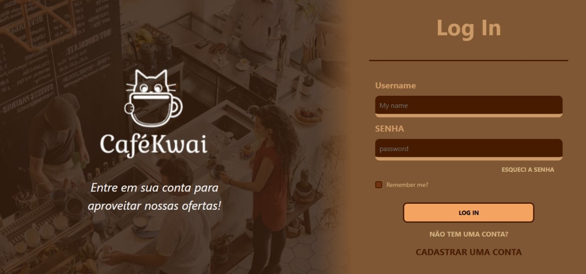

# Projeto de Conclusão de disciplina. (Em andamento...)

## ☕🐱 Projeto KwaiCafe – Cafeteria Temática com ASP.NET Razor Pages e Entity Framework
Um cantinho aconchegante onde o aroma do café recém-passado se mistura com o charme felino. Inspirada no universo dos gatos,
curiosos e carinhosos na medida certa, nossa cafeteria foi criada para ser um refúgio tranquilo no seu dia,
como o colo quentinho que um gatinho procura ao entardecer.

# Funcionalidades do Sistema
## 👥 Área pública (visitantes)
- Página inicial com destaque para promoções e eventos.

- Visualização do cardápio de Bebidas, Doces, Salgados e Kits, com imagens e descrições.

- Página dedicada a decoração de gatos temáticos da cafeteria, com sessão para curtir uma música.

- Criação de contas para agendas, delivery, e retirada na cafeteria.

- Criação de avaliações para os produtos.

## 🔐 Área administrativa (restrita)
- Login de administrador.

- CRUD completo para produtos do cardápio (cadastrar, revisar, editar, remover).

- Gerenciamento de perfis.

- Visualização de pedidos realizados.

## Tecnologias Utilizadas
- C# – Linguagem principal de backend.

- ASP.NET Core – Framework web para estruturação de páginas, rotas e lógica de interface.

- Entity Framework Core – Mapeamento objeto-relacional (ORM) para facilitar o acesso ao banco de dados.

- SQL Server – Banco de dados relacional para armazenar informações dos produtos, usuários e pedidos.

- Razor Pages / Views – Templates dinâmicos para a exibição de conteúdo.

- CSS - Para design do Front-End.

- JavaScript – Para interações dinâmicas no Front-End.

### Modelagem de Dados (Entity Framework) para SQLServer
## Principais entidades mapeadas:

- Produto (Id, Nome, Preco, Descricao, Pequena descrição, Categoria, Imagem)

- Usuario (Id, Nome, Icone de usuário, Email, SenhaHash)

- Endereço (UsuarioId FK, Apelido, Endereço(CEP), Estado, Cidade, Rua, Número, Complemento)

- Pedido (Id, UsuarioId, Data, Total, Status)
  
- Avaliação (ProdutoId, UsuarioId, Avaliação, Título, Texto, Imagens)

- ItemPedido (Id, PedidoId, ProdutoId, Quantidade)

###  Utilização migrations para versionamento do banco de dados.
###  Utilização de GitHub para versionamento de versões.
